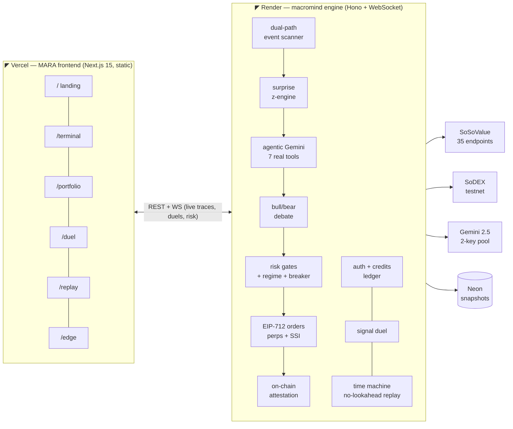

<div align="center">



<br/>

<a href="https://mara-neon.vercel.app"></a>
<a href="https://mara-backend-28va.onrender.com/healthz"></a>


<br/><br/>


</div>

# MARA: Macro-Aware Research & Execution Agent

**The terminal:** [mara-neon.vercel.app](https://mara-neon.vercel.app) · **Duel the agent:** [/duel](https://mara-neon.vercel.app/duel) · **Time Machine:** [/replay](https://mara-neon.vercel.app/replay) · **Proof of Edge:** [/edge](https://mara-neon.vercel.app/edge) · **Live cognition:** [/terminal](https://mara-neon.vercel.app/terminal) · **Desk:** [/portfolio](https://mara-neon.vercel.app/portfolio)



## 🌊 Wave 3 — built in six phases

### Phase 1 · The engine
- **Agentic AI core** — Gemini runs a transparent tool-use loop (surprise engine, catalyst corpus, ETF flows, regime, risk gates are its tools); the tool-call trace streams live to the terminal. Falls back safely to a single-call engine, and a bull/bear/synthesiser debate argues every print three ways before the verdict ships.
- **Macro-catalyst corpus** — historical CPI/NFP/PCE/PPI/FOMC prints seeded from SoSoValue history, tagged with surprise z-scores, regime labels, and real BTC/ETH forward returns (+1d/+3d/+7d/+30d).
- **35 SoSoValue endpoints** across all 9 modules, TTL-cached for the 20 req/min budget, live-probed on `/api/diag`.
- **Regime-adaptive risk + macro circuit breaker** — BULL_QUIET…CRASH classification scales position size, stops, and the conviction floor; a pre-event window de-risks around CPI/FOMC/NFP.
- **`mcp-mara`** — an 8-tool Model Context Protocol server so any AI client (Claude Desktop, Cursor, VS Code) can call MARA's calendar, corpus, conviction, risk state, track record, trade simulator, and (operator-gated) real execution.

### Phase 2 · Identity & play
- **"Amber Phosphor" design system** — a dealing-desk instrument look: molten amber phosphor + ember coral on warm oil-black, Instrument Serif editorial display, custom reticle cursor, CRT scanlines.
- **Accounts + MARA credits** — sign in with Google (server-verified ID token), any browser wallet (EIP-6963 → nonce → `personal_sign` → server-side EIP-191 recovery), or a guest pass. Real logins earn 1,000 credits in an append-only ledger; connecting a wallet *is* authentication here, not address decoration.
- **⚔️ Signal Duel (`/duel`)** — stake credits on BULL or BEAR before the agent speaks; the live pipeline resolves your duel over the WebSocket. Win pays 2×, NEUTRAL pushes, a pipeline failure refunds your stake. Win-streaks, a rank ladder from OBSERVER to MACRO SOVEREIGN, and a public accuracy leaderboard.
- **🕰️ Time Machine (`/replay`)** — scrub two years of real macro prints through MARA's decision logic with **zero lookahead** (early prints honestly report "insufficient history"); flip on Prophecy mode and the verdicts hide until you call each print yourself.

### Phase 3 · The frontend takeover
- **A frontend people can steal from** — the deployed app is `MARA/`: a Next.js 15 spatial interface (d3 guilloche fields, a three.js monetary core, magnetic cursor) where **the ambience itself is market data**: the background glow's intensity is real 30-day BTC vol and its temperature is the real trend direction, polled from the engine's regime classifier.
- **Every number traces to the engine** — the landing's meters are the live regime, the pulse cards are real decisions, the terminal streams real `agent_trace` steps, the portfolio desk shows real SoDEX positions, probes, equity and the real kill switch.
- **Dual-key Gemini pool** — automatic key rotation on quota errors across all three AI engines; the pipeline doesn't halt on a daily 429.
- **Fire Live Run from the desk** — the portfolio's trade modal triggers the real pipeline (shared 20s cooldown), so anyone can watch a print become a verdict, a risk check, and an order.

### Phase 4 · Proof, public
- **🛡️ Proof of Edge (`/edge`)** — a four-strategy gauntlet run over the corpus with zero lookahead: MARA's full policy vs a no-restraint counterfactual vs a naive z-chaser vs buy-and-hold. Includes the stand-down ledger (every trade MARA *refused*, with reasons), a per-regime honesty table, and Monte-Carlo VaR. The page links straight to the chain and the raw JSON so you don't have to take its word.
- **⛓️ Attestation on public ValueChain testnet** — `MARAAttestation` live at [`0x8BF2…1B29`](https://testnet.sodex.com/explorer/address/0x8BF2520742CCb4101f28C216fF564A221bba1B29) (chainId 138565); every verdict's keccak256 hash is batched on-chain. Operator gas was bridged via a signed SoDEX **spot→EVM withdrawal** — the same EIP-712 machinery that places orders.
- **Portfolio data plane** — signed venue reads (`/api/account`: perps balance, positions, orders, spot), SoSoValue US spot-ETF daily flows, and the quant tab (backtest incl. the Harvey-Liu 50%-discounted Sharpe).

### Phase 5 · The engagement layer
- **🎰 The Arcade** — PULSE (BTC direction, 5-min settle) and OVER/UNDER (±0.10% band): strike and settle are live SoDEX marks stored on every bet — the market is the dice, never `Math.random`. Exact tie voids and refunds.
- **🤖 Bidirectional Telegram deck** — `/start` opens a real MARA account (500 CR, same ledger as the web), then `/status /regime /next /price /bet /mybets /leaderboard /claim` — and admin-gated `/kill` & `/resume`: the actual kill switch from your pocket.
- **🗣 Gemini concierge** — a floating chat grounded in the live regime, latest verdict and kill state; 3 free questions, 100-word server-capped answers, premium unlock with credits.
- **Community layer** — feedback that lands in the operator's Telegram, referral links (+250 CR both sides), and The Floor: a strategy board with a 24h retention guarantee and 3 posts/day per operator.
- **SAFE MODE** — the kill switch is a product state: banner with reason and timestamp, duels and arcade lock, Telegram broadcast, one-press reset.

### Phase 6 · Hardening & market microstructure
- **Durability** — WAL-checkpointed Neon snapshots, Supabase durable store for community data (PostgREST dual-write with graceful fallback), transactional bet/duel settlements (a crash can't strand or double-pay), reconnect-forever exchange WebSocket, and attestation health alerts pushed to every dashboard + the operator's Telegram.
- **📈 Rolling ticker tape** — every SoDEX perps symbol, spot pair and SSI index in one marquee across the app.
- **Depth & Tape desk tab** — the venue's real order book (mid/spread) and time-and-sales prints; **Sector Spotlight** (24h sector moves + dominance) and **SSI X-Ray** (click any index for its real constituents and weights).
- **🎁 Daily Ration** — a server-enforced daily credit claim with a streak multiplier, on web and Telegram alike, plus the Credit Kings leaderboard.

MARA is a full-stack, autonomous macro-event trading and portfolio rotation system. It detects high-impact macro releases (such as CPI, Nonfarm Payrolls, and FOMC rate decisions) via a **dual-path scanner**, scores their crypto-market impact using **statistical surprise models + Gemini AI**, checks strict **risk management gates**, and executes **dual-leg trades** (BTC perpetual hedges + spot SSI index rotations) on the **SoDEX testnet** using custom **EIP-712 cryptographic signatures**.

---

## 🌐 Architecture Overview

MARA is structured as a robust four-layer system with a low-latency, real-time presentation layer.

```
┌─────────────────────────────────────────────────────────────────────┐
│                MARA FRONTEND — Next.js 15 (Port 3000)               │
│  Landing │ Terminal │ Portfolio Desk │ Signal Duel │ Time Machine   │
└──────────────────────────────┬──────────────────────────────────────┘
                               │ WebSocket + REST (NEXT_PUBLIC_API_URL)
┌──────────────────────────────┴──────────────────────────────────────┐
│                        BACKEND SERVER (Hono, Port 3001)             │
│                                                                     │
│  ┌─────────────┐  ┌──────────────┐  ┌────────────┐  ┌───────────┐ │
│  │  SCHEDULER   │  │  AI DECISION │  │   RISK     │  │  EXECUTOR │ │
│  │  (cron/poll) │→ │   ENGINE     │→ │   ENGINE   │→ │  (SoDEX)  │ │
│  └──────┬──────┘  └──────┬───────┘  └─────┬──────┘  └─────┬─────┘ │
│         │                │                 │               │        │
│  ┌──────┴──────────────────────────────────┴───────────────┴─────┐  │
│  │                     DATA SERVICE LAYER                        │  │
│  │  SoSoValue Client  │  SoDEX Client  │  Price Cache            │  │
│  └───────┬──────────────────┬────────────────────────────────────┘  │
│          │                  │                                       │
│  ┌───────┴──────┐  ┌───────┴────────┐  ┌────────────────────────┐  │
│  │  EVENT STORE  │  │  TRADE STORE   │  │  REASONING LOG STORE   │  │
│  │  (SQLite)     │  │  (SQLite)      │  │  (SQLite)              │  │
│  └──────────────┘  └────────────────┘  └────────────────────────┘  │
└─────────────────────────────────────────────────────────────────────┘
          │                       │
          ▼                       ▼
┌──────────────────┐   ┌──────────────────────┐
│  SoSoValue API   │   │  SoDEX API           │
│  (openapi.       │   │  (testnet-gw.        │
│   sosovalue.com) │   │   sodex.dev)         │
└──────────────────┘   └──────────────────────┘
```

### 1. Dual-Path Detection Flow
To react to macro releases within ~10 seconds instead of waiting minutes for official database updates:
*   **Path A (Fast Path - News Scanner):** Polls the SoSoValue `/news` endpoint every 30 seconds. Uses regex patterns to scan headlines for major macro indicators (e.g. CPI prints, payroll counts). If matched, it extracts the actual value and triggers the execution pipeline immediately.
*   **Path B (Reliable Path - History Watcher):** Polls `/macro/events/{event}/history` every 60 seconds for scheduled events. When the official `actual` field updates, it confirms or enriches the news-extracted trigger.
*   **Reconciler:** A deduping window (10 min) prevents double-fires, merging both paths gracefully.

### 2. AI Conviction Engine
*   **Surprise Calculator:** Calculates the historical standard deviation of the difference between `actual` and `forecast` consensus. The surprise score is computed as:
    $$\text{Surprise Score} = \frac{\text{Actual} - \text{Forecast}}{\sigma_{\text{history}}}$$
*   **Gemini AI Analyzer:** Takes the surprise score, 10 recent headlines, market snapshot (BTC price, ATR volatility), and recent ETF flows. It outputs a structured JSON decision: conviction level (`STRONG_BULL` to `STRONG_BEAR`), confidence (0-100), reasoning, and trade action.

### 3. Risk Engine
Protects capital by running validation rules before placing orders:
*   ATR-based position sizing and stop-loss/take-profit placement.
*   Capped maximum leverage (default 5x) and position sizes.
*   Hard limits: maximum 3 open positions, 5% max account drawdown (HWM-based), daily trade caps, and a minimum 5-minute cooldown between trades.

### 4. Dual Execution (Perps + Spot SSI Rotation)
*   **Perpetual Futures:** Places directional long/short orders on SoDEX Perps for hedging and volatility capture.
*   **SSI Index Rotation:** Simultaneously adjusts long-term holdings in SoSoValue's Sovereign Smart Indices (SSI) via SoDEX Spot, selling high-beta indices (like MAG7 or MEME) for USSI (delta-neutral yield) during bearish turns, and rotating back during bullish ones.
*   **Cryptographic Signatures:** Custom EIP-712 signing implementation on both spot and perps domains, generating byte-identical payloads matching Go SDK structs.

---

## 🛠️ Installation & Setup

### Prerequisites
*   Node.js (v20+)
*   MetaMask (or a random EVM wallet) with ValueChain Testnet configured

### Backend Configuration (`macromind`)
1.  Navigate to the backend directory:
    ```bash
    cd macromind
    ```
2.  Install dependencies:
    ```bash
    npm install
    ```
3.  Configure your environment variables in `.env` (refer to `.env.example`):
    ```env
    SOSOVALUE_API_KEY=your_key
    GEMINI_API_KEY=your_gemini_key
    SODEX_MASTER_ADDRESS=0xYourWalletAddress
    SODEX_API_KEY_NAME=macromind-agent
    SODEX_API_KEY_PRIVATE=your_wallet_private_key
    SODEX_ACCOUNT_ID=your_sodex_account_id
    # Optional — enables "Continue with Google" (same OAuth client ID both sides):
    GOOGLE_CLIENT_ID=xxxx.apps.googleusercontent.com
    ```
    > **Google Sign-In setup (2 min):** [console.cloud.google.com](https://console.cloud.google.com) → APIs & Services → Credentials → *Create OAuth client ID* → Web application → add your site origin (e.g. `https://mara-neon.vercel.app` and `http://localhost:3000`) to *Authorized JavaScript origins* → copy the client ID into `GOOGLE_CLIENT_ID` (backend env) **and** `NEXT_PUBLIC_GOOGLE_CLIENT_ID` (frontend env / `MARA/.env.production`). Wallet and guest login work with zero configuration.

### Frontend Configuration (`MARA/` — the deployed Next.js app)
1.  Navigate to the frontend directory:
    ```bash
    cd MARA
    ```
2.  Install dependencies:
    ```bash
    npm install
    ```
3.  `MARA/.env.local` points at the local backend by default (`NEXT_PUBLIC_API_URL=http://localhost:3001`); production builds bake the Render origin from the committed `MARA/.env.production`. Set `NEXT_PUBLIC_GOOGLE_CLIENT_ID` to enable the Google button.

> The previous Vite dashboard (`mara-macro-dashboard/`) remains in the repo as a legacy fallback but is no longer deployed.

---

## 🚀 Running the Project

### 1. Run Backend Server
From the `macromind` directory, start the development server:
```bash
npm run dev
```
The server will initialize a SQLite database (`mara.db`), run migrations, start the background schedulers, and listen on `http://localhost:3001` and `ws://localhost:3001/ws`.

### 2. Run the MARA Frontend
From the `MARA` directory, start the Next.js dev server:
```bash
npm run dev
```
Open `http://localhost:3000`. The app talks straight to the backend origin from `NEXT_PUBLIC_API_URL` (REST + WebSocket) — no proxy involved.

### 3. Run Automated Tests
You can run targeted tests for individual modules inside the `macromind` folder:
*   `npm run test:sosovalue` - Tests SoSoValue API client connectivity.
*   `npm run test:sodex` - Tests SoDEX public and private read clients.
*   `npm run test:surprise` - Validates standard deviation and surprise score calculations.
*   `npm run test:ai` - Assesses the Gemini AI prompt and structured JSON outputs.
*   `npm run test:sign` - Validates EIP-712 signing correctness on testnet.
*   `npm run test:pipeline` - Runs the end-to-end event-to-execution pipeline test.
*   `npm run typecheck` - Typechecks the codebase using TypeScript.

---

## 🔌 API Endpoints Reference

The backend Hono server exposes the following REST routes:

| Method | Endpoint | Description |
| :--- | :--- | :--- |
| **GET** | `/api/status` | Returns system health, uptime, and kill switch status. |
| **GET** | `/api/events` | Returns recent and upcoming macro calendar events from SQLite. |
| **GET** | `/api/decisions` | Returns historical AI trade decisions with complete reasoning. |
| **GET** | `/api/trades` | Returns executed trades history. |
| **GET** | `/api/risk` | Returns real-time risk parameters, drawdown, and win-rate statistics. |
| **GET** | `/api/news` | Returns a cached feed of SoSoValue headlines. |
| **POST**| `/api/trigger` | Injects a simulated macro event to trigger the pipeline end-to-end. |
| **POST**| `/api/kill-switch` | Forces an emergency halt, cancels open orders, and closes positions. |
| **POST**| `/api/kill-switch/reset` | Resets the kill switch state and resumes scanning. |
| **POST**| `/api/auth/guest` · `/api/auth/google` · `/api/auth/wallet/nonce` · `/api/auth/wallet/verify` | Accounts: guest pass, verified Google ID token, signature-verified wallet login. |
| **GET** | `/api/auth/me` | Session introspection + MARA credits balance + ledger tail. |
| **POST**| `/api/duel/start` | Stake credits on BULL/BEAR; the live pipeline resolves the duel. |
| **GET** | `/api/duel/mine` · `/api/duel/leaderboard` | Your duel record; public leaderboard vs the agent. |
| **GET** | `/api/replay/events` · `/api/replay?event_type=CPI` | Time Machine: no-lookahead corpus replay timelines. |
| **GET** | `/api/edge` | Proof of Edge: the four-strategy no-lookahead gauntlet + stand-down ledger + MC VaR. |
| **GET** | `/api/account` · `/api/etf` · `/api/klines` · `/api/indices` · `/api/treasuries` | Signed venue reads, US spot-ETF flows, real candles, SSI indices, BTC treasuries. |
| **GET** | `/api/ticker` · `/api/depth` · `/api/tape` · `/api/sectors` · `/api/indices/:t/constituents` | Ticker tape, live order book, time & sales, sector spotlight, SSI X-Ray. |
| **GET/POST** | `/api/arcade` · `/api/arcade/bet` · `/api/arcade/mine` | The Arcade: config + stats, place a bet on live marks, your bets. |
| **GET/POST** | `/api/chat` · `/api/chat/quota` · `/api/chat/unlock` | Gemini concierge: grounded answers, quota, premium unlock. |
| **GET/POST** | `/api/claim` · `/api/leaderboard/credits` · `/api/comments` · `/api/feedback` · `/api/referral` | Daily Ration, Credit Kings, The Floor, support requests, referral links. |
| **GET** | `/api/evm/balance?address=0x…` | Any wallet's native SOSO on ValueChain via `eth_getBalance`. |
| **GET** | `/api/regime` · `/api/markets` · `/api/ssi` · `/api/diag` · `/api/track` · `/api/backtest` | Live regime + breaker, tickers, SSI state, integration diagnostics, track record, backtest. |

---

## 🏆 Rubric Alignment & Scoring Self-Audit

MARA has been architected to hit every criteria and bonus category in the judging rubric:

| Criteria | Category | MARA Implementation | Status |
| :--- | :--- | :--- | :--- |
| **Genuine SoSoValue API** | **Required** | Uses **35+ endpoints across all 9 modules** — macro calendar/history, news, currencies, ETFs, indices, crypto-stocks, sector data — live-probed on `/api/diag`. | **YES** |
| **Clear Use Case** | **Required** | Focuses on high-impact macro data releases that trigger short-term directional perps hedges and spot index reallocations. | **YES** |
| **Real User Value** | **Required** | Automates a complex workflow that typically requires an analyst, risk manager, portfolio manager, and execution trader. | **YES** |
| **Complete Flow** | **Required** | End-to-end from live data ingest -> AI reasoning -> risk filtering -> on-chain execution. | **YES** |
| **SoDEX Integration** | **Bonus** | Integrates both **Spot** and **Perps** markets using custom **EIP-712 signature generation**. | **YES** |
| **AI-Enhanced** | **Bonus** | Leverages Gemini AI for structured reasoning and sentiment amplification. | **YES** |
| **Discovery Opportunity**| **Bonus** | Surfaces trade signals based on statistical variance from expectations. | **YES** |
| **Generates Signals** | **Bonus** | Quantitative surprise score translates directly to conviction levels. | **YES** |
| **Explains Markets** | **Bonus** | Expandable "Reasoning Cards" on the dashboard explain the reasoning behind each trade in plain English. | **YES** |
| **Risk Control** | **Bonus** | Position sizing based on ATR volatility, stop-loss attachment, drawdown monitoring, and kill switch. | **YES** |
| **Confirmation** | **Bonus** | Confirms news scanner triggers with official event data and ETF institutional flow trends. | **YES** |
| **Security Awareness** | **Bonus** | Never exposes private keys or API credentials to the client; all cryptographic actions occur on the server. | **YES** |
| **Product Experience** | **Bonus** | Features a beautiful Bloomberg-terminal styled 6-panel real-time grid dashboard with WebSockets. | **YES** |

---

## ⛓️ On-Chain Attestation Layer (`mara-attestation`)

MARA uses a Solidity smart contract on the **public ValueChain testnet** to record an immutable audit trail of its trading decisions — live at [`0x8BF2520742CCb4101f28C216fF564A221bba1B29`](https://testnet.sodex.com/explorer/address/0x8BF2520742CCb4101f28C216fF564A221bba1B29) (chainId 138565). This ensures that the agent's historical performance and reasoning cannot be tampered with.

### Contract Features
- **Immutable Decisions**: Stores the keccak256 hash of every trade decision, conviction level, and action.
- **Operator Verification**: Proves that the MARA instance is operated by the designated wallet.
- **Strategy Versioning**: Logs immutable records of strategy upgrades or risk parameter changes.
- **Kill Switch Mirroring**: Mirrors the off-chain kill switch state on-chain for transparency.

### Deployment Instructions
1.  Navigate to the attestation directory:
    ```bash
    cd mara-attestation
    ```
2.  Install dependencies:
    ```bash
    npm install
    ```
3.  Deploy to ValueChain Testnet:
    ```bash
    npm run deploy:testnet
    ```
4.  Copy the deployed contract address and paste it into `macromind/.env` as `MARA_CONTRACT_ADDRESS`.

---

## ✅ Submission Checklist

- [x] **SoSoValue API**: 35+ endpoints across all 9 modules (Macro, News, Currencies, ETFs, Indices, Crypto-stocks, Sectors).
- [x] **SoDEX Integration**: EIP-712 signing for Perps, Spot, and spot→EVM asset transfers.
- [x] **AI Decision Engine**: Gemini agentic tool-use loop + debate + structured fallback, dual-key pool.
- [x] **Risk Management**: ATR-based sizing, regime-adaptive gates, drawdown monitoring, kill switch with SAFE MODE.
- [x] **Real-Time Product**: 7-route Next.js terminal + WebSocket cognition stream + Telegram deck.
- [x] **Audit Trail**: On-chain attestation live on public ValueChain testnet ([explorer](https://testnet.sodex.com/explorer/address/0x8BF2520742CCb4101f28C216fF564A221bba1B29)).
- [x] **Documentation**: Complete setup instructions and architecture overview.

---

## 📚 Project Documentation

For deeper details on MARA's design, verification, and plans, please refer to the following guides:

*   **[Demo Showcase & Presentation Guide](docs/showcase_guide.md)**: Script, walkthrough steps, and judge questions.
*   **[Terminal Demo Runbook](docs/DEMO.md)**: Setup commands and expected console outputs.
*   **[Single Source of Truth (Operator Identity)](docs/IDENTITY.md)**: Proof of system-wide identity coherence.
*   **[Architecture Specification](docs/architecture.md)**: Detailed module layout and sequence diagrams.
*   **[Project Idea & Context](docs/idea.md)**: Problem explanation, solution, and roadmap.
*   **[7-Day Build Plan](docs/plan.md)**: Daily progression checklist.
*   **[Test & Acceptance Criteria](docs/test.md)**: Verification checklist.

---

## 📖 Presentation & Showcase Guide

The complete step-by-step video script, EIP-712 details, and validation Q&As are documented in the [MARA Demo Showcase & Presentation Guide](docs/showcase_guide.md).


